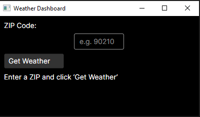

# Simple Weather Project

A simple cross-platform Weather Dashboard built with:

- **WeatherApi**: ASP.NET Core 8 Minimal API (LTS release) proxying OpenWeatherMap
- **WeatherClient**: Avalonia UI desktop client (Windows, macOS, Linux)



---

## Features

- Enter a U.S. ZIP code to fetch current weather
- Proxy handles API key securely via configuration
- Live display of temperature in °F

## Prerequisites

- [.NET 8 SDK](https://dotnet.microsoft.com/download/dotnet/8.0) (LTS release)
- (Optional) [Docker & Docker Compose](https://www.docker.com/get-started)

## Getting Started

### 1. Clone the repository

```bash
git clone https://github.com/yourusername/SimpleWeatherProject.git
cd SimpleWeatherProject
```

### 2. Configure your OpenWeatherMap API key

You need a free API key from [OpenWeatherMap](https://openweathermap.org/api).

- **Step 1: Copy the template**
  ```bash
  cp WeatherApi/appsettings.example.json WeatherApi/appsettings.json
  ```

- **Step 2: Edit your key**
  Open **WeatherApi/appsettings.json** and replace:
  ```json
  {
    "OpenWeatherMap": {
      "Key": "YOUR_API_KEY_HERE"
    }
  }
  ```
  with your actual API key.

You need a free API key from [OpenWeatherMap](https://openweathermap.org/api).


### 3. Run both projects locally

From the repo root, run:

```bash
dotnet run --project WeatherApi --urls "http://localhost:5000" & \
  dotnet run --project WeatherClient
```

This will start the API at `http://localhost:5000` (no browser) and then launch the desktop client.

### 4. (Optional) Run with Docker Compose

If you have Docker installed, you can launch both services together:

```bash
# At repo root
docker-compose up --build
```

- API on `http://localhost:5000` (HTTP) and `https://localhost:5001` (HTTPS)
- Client packaged as a container listening on port `5001` (see `docker-compose.yml`)

---

## Troubleshooting

- **API 404 on /**: Use the `/weather/{zip}` route, e.g. `http://localhost:5000/weather/90210`.
- **HTTPS certificate errors**: Trust the ASP.NET Core dev certificate or use HTTP on port 5000 for development.

---

## License

MIT © Huy Doan

